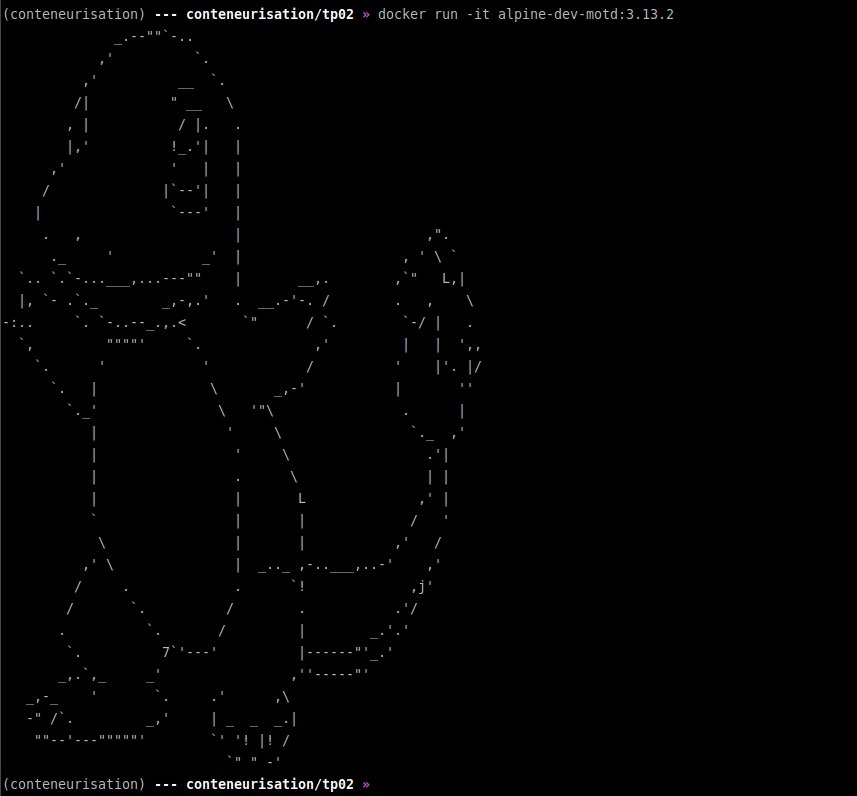
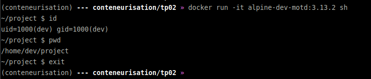

# Conteneurisation M2 TP02

## Initiation au Dockerfile

* Build and first start
```bash
(conteneurisation) --- conteneurisation/tp02 » cat Dockerfile 
FROM alpine:3.13.2

RUN adduser --home /home/dev --shell /bin/sh --disabled-password dev

ENV PROJECT_DIR=/home/dev/project
USER dev
WORKDIR ${PROJECT_DIR}
COPY motd /etc/motd

CMD ["cat", "/etc/motd"]
(conteneurisation) --- conteneurisation/tp02 » docker build . -t alpine-dev-motd:3.13.2
Sending build context to Docker daemon  4.608kB
Step 1/7 : FROM alpine:3.13.2
 ---> 28f6e2705743
Step 2/7 : RUN adduser --home /home/dev --shell /bin/sh --disabled-password dev
 ---> Using cache
 ---> d3dcb4803478
Step 3/7 : ENV PROJECT_DIR=/home/dev/project
 ---> Using cache
 ---> 2124f852cc36
Step 4/7 : USER dev
 ---> Using cache
 ---> d686692fd895
Step 5/7 : WORKDIR ${PROJECT_DIR}
 ---> Using cache
 ---> 3f1c113a8f95
Step 6/7 : COPY motd /etc/motd
 ---> Using cache
 ---> 4b2fa96b3f25
Step 7/7 : CMD ["cat", "/etc/motd"]
 ---> Using cache
 ---> 91f012ccb922
Successfully built 91f012ccb922
Successfully tagged alpine-dev-motd:3.13.2
(conteneurisation) --- conteneurisation/tp02 » docker run -it alpine-dev-motd:3.13.2
              _.--""`-..
            ,'          `.
          ,'          __  `.
         /|          " __   \
        , |           / |.   .
        |,'          !_.'|   |
      ,'             '   |   |
     /              |`--'|   |
    |                `---'   |
     .   ,                   |                       ,".
      ._     '           _'  |                    , ' \ `
  `.. `.`-...___,...---""    |       __,.        ,`"   L,|
  |, `- .`._        _,-,.'   .  __.-'-. /        .   ,    \
-:..     `. `-..--_.,.<       `"      / `.        `-/ |   .
  `,         """"'     `.              ,'         |   |  ',,
    `.      '            '            /          '    |'. |/
      `.   |              \       _,-'           |       ''
        `._'               \   '"\                .      |
           |                '     \                `._  ,'
           |                 '     \                 .'|
           |                 .      \                | |
           |                 |       L              ,' |
           `                 |       |             /   '
            \                |       |           ,'   /
          ,' \               |  _.._ ,-..___,..-'    ,'
         /     .             .      `!             ,j'
        /       `.          /        .           .'/
       .          `.       /         |        _.'.'
        `.          7`'---'          |------"'_.'
       _,.`,_     _'                ,''-----"'
   _,-_    '       `.     .'      ,\
   -" /`.         _,'     | _  _  _.|
    ""--'---"""""'        `' '! |! /
                            `" " -' 
(conteneurisation) --- conteneurisation/tp02 » 
```
* proof
```bash
(conteneurisation) --- conteneurisation/tp02 » docker run -it alpine-dev-motd:3.13.2 sh
~/project $ id
uid=1000(dev) gid=1000(dev)
~/project $ pwd
/home/dev/project
~/project $ exit
(conteneurisation) --- conteneurisation/tp02 » 
```
* proof picture


